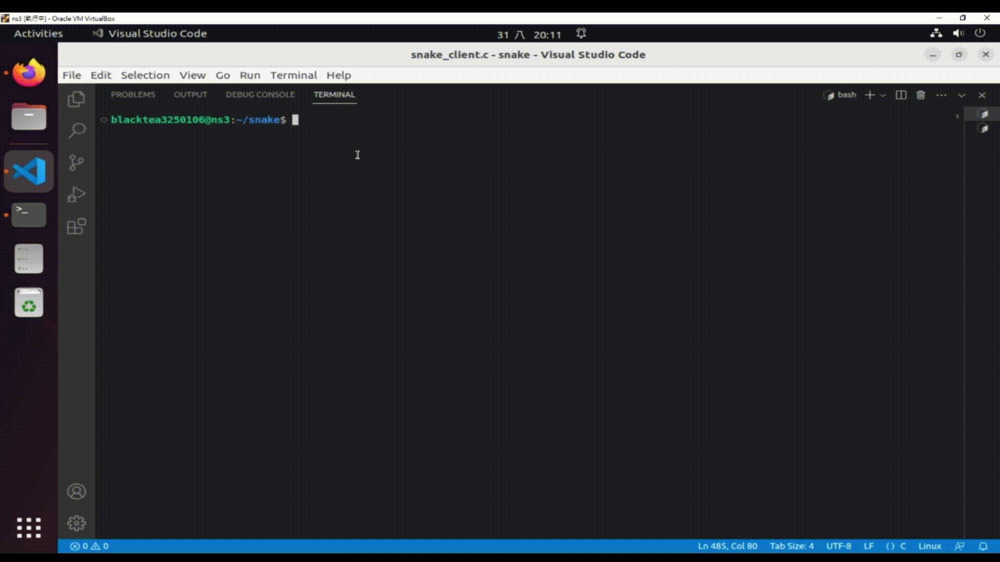

# DoubleSnake Showdown



Welcome to DoubleSnake Showdown, a thrilling two-player snake game implemented in C using the ncurses library. In this game, you and a friend can control two separate snakes and compete to achieve the highest score. Be prepared for challenging gameplay with randomly appearing obstacles!


## Table of Contents

- [Table of Contents](#table-of-contents)
- [Prerequisites](#prerequisites)
- [How to Play](#how-to-play)
- [Gameplay](#gameplay)
- [Objective](#objective)
- [Death Mechanisms](#death-mechanisms)
- [End of Game and Leaderboard](#end-of-game-and-leaderboard)
- [Authors](#authors)
- [License](#license)

## Prerequisites

Before you can enjoy the DoubleSnake Showdown, ensure that you have the following prerequisites installed on your Linux system:

- GCC (GNU Compiler Collection): You need GCC to compile the game program.

    ```bash
    sudo apt-get install gcc
    ```

- ncurses Library: The game uses the ncurses library for its interface.

    ```bash
    sudo apt-get install libncurses-dev
    ```

## How to Play

1. Compile the server program:

    ```bash
    gcc -o server server.c
    ```

2. Compile the snake game program:

    ```bash
    gcc -o snake snake.c -lncurses
    ```

3. Run the server:

    ```bash
    ./server
    ```

4. In a separate terminal window, run the snake game program:

    ```bash
    ./snake
    ```

## Gameplay

- Player 1 controls Snake 1 using the arrow keys and can speed up with 'f' or slow down with 's'.
- Player 2 controls Snake 2 using 'a', 'd', 'w', and 's' keys and can speed up with '1' or slow down with '2'.

## Objective

- Collect the randomly generated food items to increase your score.
- Beware of obstacles! Collisions with bomb, the wall, your own body, or your opponent's body will result in the end of the game.

## Death Mechanisms

Your snakes can meet their demise in the following ways:

1. **Hitting the Wall:** If a player's snake collides with the map's boundaries, the snake will die, and the game will come to an end.

2. **Self-Collision:** If a player's snake collides with its own body, the snake will die, and the game will conclude.

3. **Encountering a Bomb:** Random bombs will appear in the game. If a player's snake consumes a bomb, the snake will die, and the game will terminate.

4. **Colliding with Your Opponent:** If your snake runs into the body of the other player's snake, your snake will die, and the game will end.

## End of Game and Leaderboard

- When one of the players' snakes dies, the game ends.
- The player's score is sent to the server.
- The server generates a leaderboard to showcase the performance of different players.

Enjoy the thrill of the DoubleSnake Showdown!

## Authors

- [blacktea3250106](https://github.com/blacktea3250106)

## License

This project is licensed under the [License Name] License - see the [LICENSE.md](LICENSE.md) file for details.
